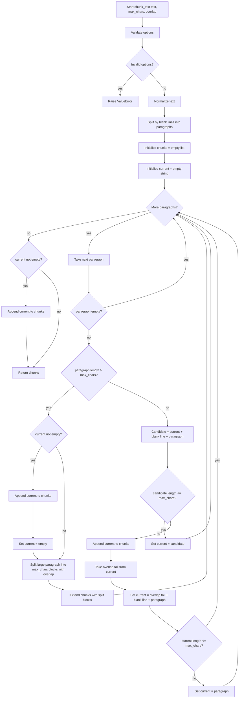

# context9

## Pre-commit

Install and run pre-commit from the project's dev environment:

```sh
uv sync --dev
uv run pre-commit install --install-hooks --hook-type pre-commit --hook-type pre-push --hook-type commit-msg
uv run pre-commit run --all-files
```

The hooks themselves use `uv run --frozen`, so Python commands run with the interpreter selected for
this project, for example the version pinned in `.python-version`.



